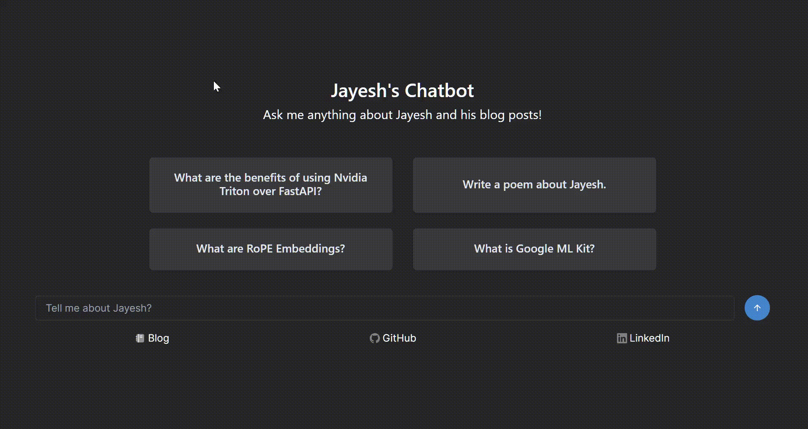

# RAG-from-scratch
This repo containes codebase for a Retrieval-Augmented Generation (RAG) based [chatbot](https://chat.jayeshdev.com) that I built for my [technical blog](https://jayeshmahapatra.github.io).

<figure>
    
    <figcaption>Asking the chatbot questions about my blog</figcaption>
</figure>

## Codebase and Tech

The application is built using the following technologies:

1. **Backend**:
    - [Langchain](https://www.langchain.com/) for Retrieval-Augmented Generation (RAG) logic
    - [FastAPI](https://fastapi.tiangolo.com/) & [LangServe](https://www.langchain.com/langserve) for serving API endpoints
    - [Langfuse](https://langfuse.com/) for monitoring and tracking
    - [Chroma](https://www.trychroma.com/) as the Vector Database
2. **Frontend**:
    - [NextJS](https://nextjs.org/) & [Chakra UI](https://chakra-ui.com/) for the UI
    - [LangchainJS](https://js.langchain.com/docs/get_started/introduction) for interacting with backend APIs
3. **Deployment**:
    - [Docker](https://www.docker.com/) for containerization and multi stage builds
    - [Docker Compose](https://docs.docker.com/compose/) for orchestrating multi-container applications


The codebase is built on top of the excellent [chat-langchain](https://github.com/langchain-ai/chat-langchain) repo by langchain, and carries the same [MIT License](./LICENSE). I made the following modifications to the original code:

1. **Backend**:
    - Refactor to use self hosted Chroma Vector Database (with security) instead of Weaviate Cloud.
    - use [Together AI](https://www.together.ai/) for embedding and answer generation.
    - Add support for parsing using Unstructured IO during ingestion.
    - Refactor the chain code improving modularity and maintainability.
    - Change prompting structure and replace RAG prompt with a more compact version.
    - Add support for using Langfuse instead of Langsmith for monitoring.
2. **Frontend**:
    - Removed Langsmith integration
    - Modified the example prompts and page contents
    - Added footer element for links to my social
3. **Deployment**:
    - Added Dockerfiles with multi stage building for backend and frontend to keep deployment lightweight.

## Usage

#### 1. Clone the repository
To get started, clone this repository to your local machine using the following command:
```
git clone https://github.com/jayeshmahapatra/rag-chatbot
```
#### 2. Modify the configs and env files
- Backend
    -   Modify `dev.config` or `prod.config` at `rag_chatbot_backend/chatbot_backend/configs` depending on your deployment target.
    - Create a `chroma/chroma.env` file with the same format and info as `chroma/chroma.env.example`.
    - Create a `rag_chatbot_backend/keys.env` file with the same format and info as `rag_chatbot_backend/keys.env.example`.
- Frontend env file
    - create a `rag_chatbot_frontend/.env.local` file with the same format and info as `rag_chatbot_frontend/.env.example`


#### 3. Build the images and deploy the containers using docker compose
Use docker compose to build and deploy in detached mode.

```
docker compose -f docker-compose.dev.yml up --build -d
```

For production environment
```
docker compose -f docker-compose.prod.yml up --build -d
```

#### 4. (Optional) Poplulate the Vector Database
If the mounted folders have no data in them, the Chroma Vector Database will be empty.
You can populate it by running an interactive session with the backend container and running the `ingestion_pipeline.py`.

Find the name or ID of backend container using docker
```
docker ps
```

Launch an interactive session
```
docker exec -it <backend_container_id_or_name> /bin/bash
```

Execute the ingestion pipeline
```
python ingestion_pipeline.py
```

## Repo Structure

The repository structure is organized as follows:

1. **Root:**
    - Contains the Docker Compose files for both development `docker-compose.dev.yml` and production `docker-compose.prod.yml`.

2. **Chroma:**
    - Contains environment files `chroma.env` for the Chroma Vector Database used in the project.

3. **rag_chatbot_backend:**
    - Contains the backend codebase for the RAG chatbot.
    - **chatbot_backend:**
        - Contains the core components of the chatbot backend:
            - `chain`: Implements the retrieval-augmented generation logic using langchain.
            - **configs:** Contains configuration files `dev.config`, `prod.config` for different deployment environments.
            - `ingestion_pipeline.py`: Script for populating the Chroma Vector Database.
            - `main.py`: Main FastAPI entry point for the backend langserve server.
            - **utils:** Contains utility functions that are used during ingestion.

4. **rag_chatbot_frontend:**
    - Contains the frontend codebase for the RAG chatbot.
    - **app:**
        - **components:** Contains reusable UI components for the chatbot interface.
        - `globals.css`: Global styles for the frontend.
        - `layout.tsx` and `page.tsx`: Layout and page components.
        - **utils:** Contains constants (`constants.tsx`).
    - Other configuration and build files:
        - `.env.example` and `.env.local`: Environment variable files.

